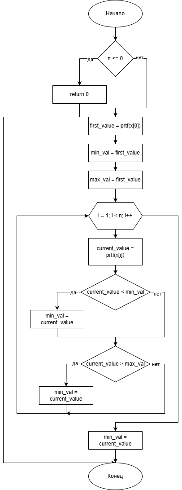

# Домашнее задание

## Условие задачи
**Реализация функции calculate() с использованием указателей на функции**

Реализовать функцию `calculate(TFun prtf, double *x, int n)`, которая по заданной указателем `prtf` функции для значений массива `x` размера `n` вычисляет сумму максимального и минимального значений функции.

## 1. Алгоритм и блок-схема

### Алгоритм функции calculate()
1. **Начало**
2. Проверить корректность размера массива:
   - Если `n <= 0`, вывести сообщение об ошибке и вернуть 0
3. Вычислить значение функции для первого элемента массива:
   - `first_value = prtf(x[0])`
4. Инициализировать переменные:
   - `min_val = first_value`
   - `max_val = first_value`
5. Вывести значение функции для первого элемента
6. Для каждого следующего элемента массива (от 1 до n-1):
   - Вычислить текущее значение функции: `current_value = prtf(x[i])`
   - Вывести значение функции для текущего элемента
   - Обновить минимальное значение:
     - Если `current_value < min_val`, то `min_val = current_value`
   - Обновить максимальное значение:
     - Если `current_value > max_val`, то `max_val = current_value`
7. Вывести найденные минимальное и максимальное значения
8. Вернуть сумму минимального и максимального значений: `return min_val + max_val`
9. **Конец функции**

### Блок-схема алгоритма
 

[https://github.com/glebofrl/lab22VSTU/blob/master/scheme.png](https://github.com/glebofrl/lab22VSTU/blob/master/scheme.png)

## 2. Реализация программы

```
#include <locale.h>
#include <stdio.h>
#include <string.h>
#include <math.h>

typedef double (*Tfun)(double);

double fun1(double);
double fun2(double);
double fun3(double);
void out_rez(Tfun func, double start, double end, double step);
double calculate(Tfun prtf, double* x, int n);


void main() {
	setlocale(LC_CTYPE, "RUS");
	//double x;
	printf("Введите x (x > 0): ");
	//scanf("%lf", &x);


	double x[] = { 0.1, 0.5, 1.0, 1.5, 2.0, 2.5, 3.0 };
	int n = sizeof(x) / sizeof(x[0]);

	printf("Массив значений x:\n");
	for (int i = 0; i < n; i++) {
		printf("%.2lf ", x[i]);
	}
	printf("\n\n");
	printf("Результаты fun1:\n");
	double result1 = calculate(fun1, x, n);
	printf("Сумма max и min значений: %.6lf\n\n", result1);

	printf("Результаты fun2:\n");
	double result2 = calculate(fun2, x, n);
	printf("Сумма max и min значений: %.6lf\n\n", result2);

	printf("Результаты fun3:\n");
	double result3 = calculate(fun3, x, n);
	printf("Сумма max и min значений: %.6lf\n", result3);

	return 0;


}

double fun1(double x) {

	return (3.0 / 2.0) * log(x);
}

double fun2(double x) {
	if (x > 1.0) {
		double arg = x * x - 1.0;
		double tan_val = tan(arg);

		if (tan_val < 0) {
			return 0;
		}
		return sqrt(tan_val);
	}
	else if (x <= 1 && x >= 0) {
		return -2.0 * x;
	}
	else {
		return exp(cos(x));
	}

}
double calculate(Tfun prtf, double* x, int n) {
	if (n <= 0) {
		printf("Некорректный размер\n");
		return 0;
	}

	double first_value = prtf(x[0]);
	double min_val = first_value;
	double max_val = first_value;

	printf("x[0] = %.2lf, f(x[0]) = %.6lf\n", x[0], first_value);

	for (int i = 1; i < n; i++) {
		double current_value = prtf(x[i]);
		printf("x[%d] = %.2lf, f(x[%d]) = %.6lf\n", i, x[i], i, current_value);

		if (current_value < min_val) {
			min_val = current_value;
		}
		if (current_value > max_val) {
			max_val = current_value;
		}
	}

	printf("Минимальное значение: %.6lf\n", min_val);
	printf("Максимальное значение: %.6lf\n", max_val);

	return min_val + max_val;
}

double fun3(double x) {
	double t = (x - 1.0) / (x + 1.0);
	double t_squared = t * t;

	return t * (1.0 + t_squared * (1.0 / 3.0 + t_squared * (1.0 / 5.0 + t_squared * (1.0 / 7.0))));
}

void out_rez(Tfun func, double start, double end, double step) {
	for (double x = start; x <= end + 0.00001; x += step) {
		double result = func(x);
		printf("%9.3lf | %12.6lf\n", x, result);
	}
}
```
## 3. Результаты работы программы


## 4. Информация о разработчике

Капичников Юрий, бИПТ-252

